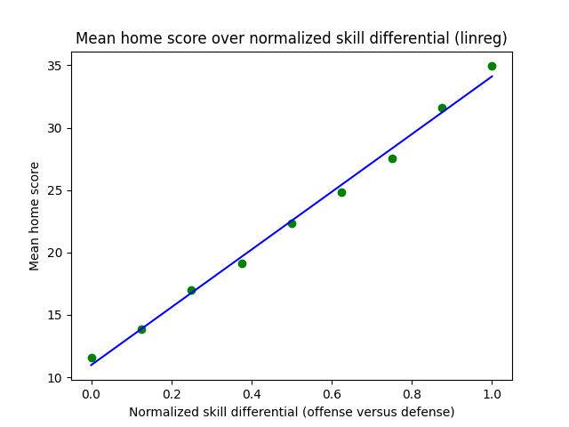
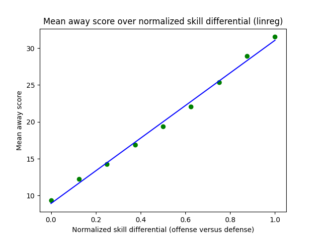
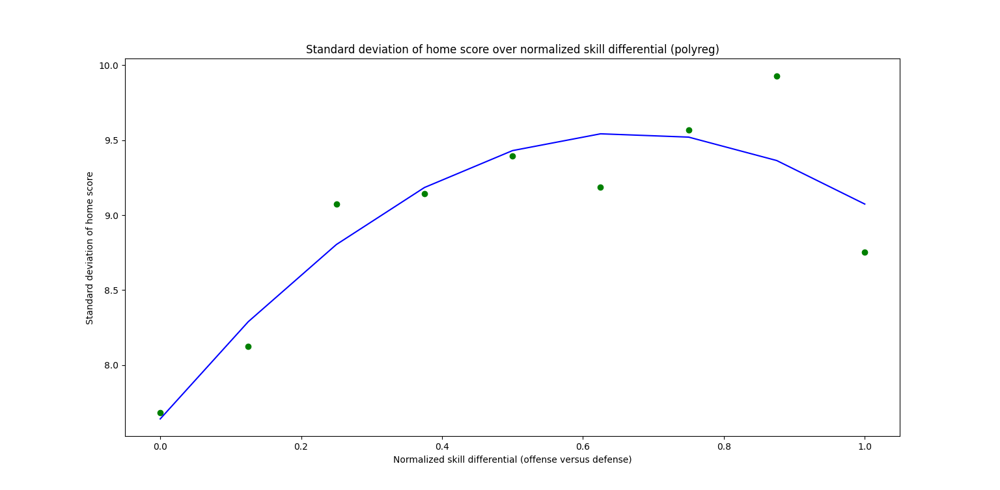
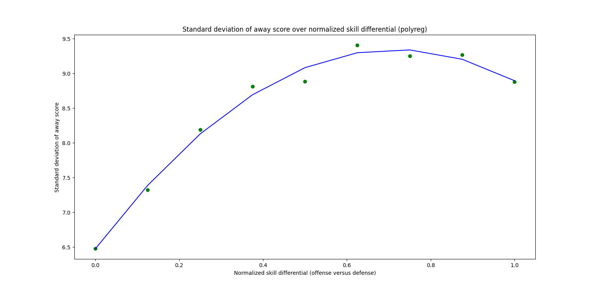

# The Football Database Box Score EDA

> Exploratory data analysis over historic box score data scraped from the football database

## Overview

This repository contains python scripts used to explore and ultimately train four regression models for generating football box scores given the home & away teams' offensive and defensive skill ratings.  The data used to train these models are stored in this repository, and include the entire super bowl era's worth of box scores.

## Results

Below are the expanded polynomial forms of the trained regression models for predicting the mean and standard deviation of a team's score in football given the differential between the team's offensive skill rating and their opponent's defensive skill rating.

## Home Mean Score Model

```
mu_home_score = 23.14578315 skill_diff + 10.9716991
```



## Away Mean Score Model

```
mu_away_score = 22.14952374 skill_diff + 8.92113289
```



## Home Score Standard Deviation Model

```
rho_home_score = 7.64006156 + 5.72612946 skill_diff - 4.29283414 skill_diff^2
```



## Away Score Standard Deviation Model

```
rho_away_score = 6.47638621 + 8.00861267 skill_diff - 5.589282 skill_diff^2
```


